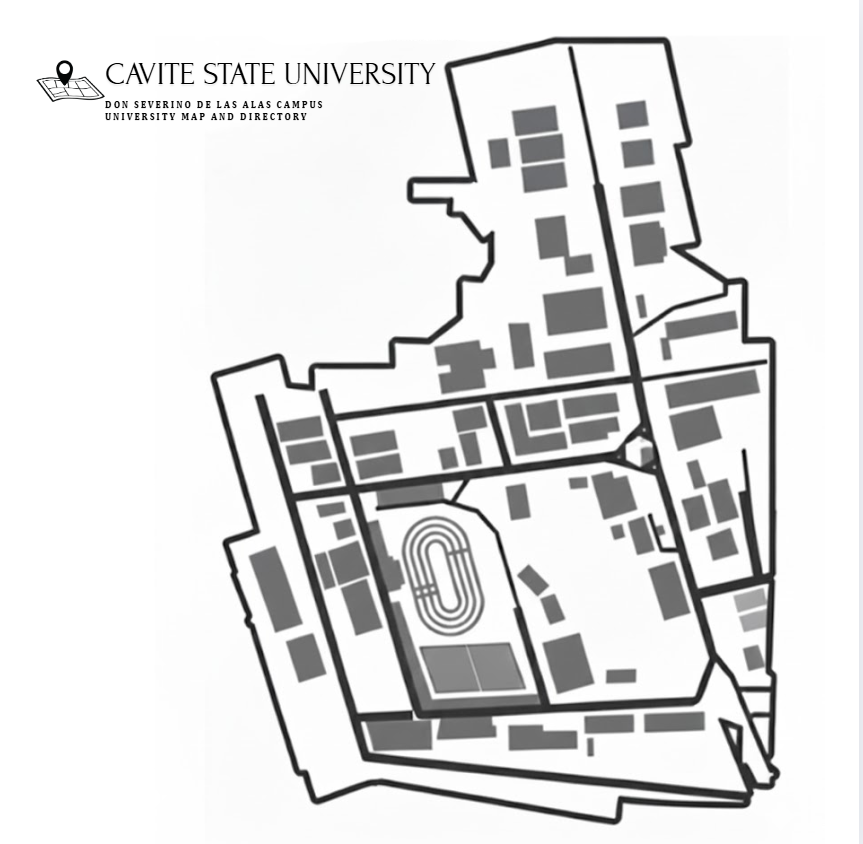

# CvSU Campus Map - Code Documentation

This document provides a comprehensive overview of the codebase, explaining what each block of code does and where to find it in the project.

---

## Table of Contents

1. [Authentication System](#authentication-system)
2. [Main Application Interface](#main-application-interface)
3. [Pin Management API](#pin-management-api)
4. [Frontend JavaScript](#frontend-javascript)
5. [Styling](#styling)
6. [Data Storage](#data-storage)

---

## Authentication System

### Login Page - `index.php`
**Location:** `/index.php` (Lines 1-39)

**Purpose:** Displays the login interface for both administrators and guests.

**Code:**
```php
<!DOCTYPE html>
<html lang="en">
<head>
    <meta charset="UTF-8">
    <meta name="viewport" content="width=device-width, initial-scale=1.0">
    <title>CvSU Campus Map - Login</title>
    <link rel="stylesheet" href="css/style.css">
</head>
<body>
    <div class="container">
        <div class="login-box">
            <h1>CvSU Campus Map</h1>
            <p>Welcome! Please login to continue.</p>
            
            <form action="login.php" method="post">
                <h2>Administrator Login</h2>
                
                <?php if (isset($_GET['error'])): ?>
                    <p class="error">Invalid email or password!</p>
                <?php endif; ?>
                
                <label for="email">Email:</label>
                <input type="email" id="email" name="email" required>
                
                <label for="password">Password:</label>
                <input type="password" id="password" name="password" required>
                
                <button type="submit">Login as Admin</button>
            </form>
            
            <div class="guest-section">
                <p>Or</p>
                <a href="login.php?guest=true" class="guest-link">Continue as Guest</a>
            </div>
        </div>
    </div>
</body>
</html>
```

**Key Components:**
- **HTML Structure (Lines 1-11):** Sets up the page with proper meta tags and links to the stylesheet
- **Login Form (Lines 15-29):** 
  - Form submits to `login.php` via POST method
  - Collects email and password for admin authentication
  - Displays error message if login fails (Lines 18-20)
- **Guest Access (Lines 31-34):** Provides a link to continue as a guest without credentials
- **Error Handling (Lines 18-20):** Shows error message when `?error=1` is present in URL

---

### Login Processing - `login.php`
**Location:** `/login.php` (Lines 1-33)

**Purpose:** Handles authentication logic for both admin and guest users.

**Code:**
```php
<?php
session_start();

// Guest login
if (isset($_GET['guest']) && $_GET['guest'] === 'true') {
    $_SESSION['logged_in'] = true;
    $_SESSION['role'] = 'guest';
    header('Location: main.php');
    exit;
}

// Admin login
if ($_SERVER['REQUEST_METHOD'] === 'POST') {
    $email = $_POST['email'];
    $password = $_POST['password'];
    
    // Simple hardcoded credentials (beginner level)
    if ($email === 'admin@cvsu.edu.ph' && $password === 'admin123') {
        $_SESSION['logged_in'] = true;
        $_SESSION['role'] = 'admin';
        header('Location: main.php');
        exit;
    } else {
        header('Location: index.php?error=1');
        exit;
    }
}

// If accessed directly, redirect to index
header('Location: index.php');
exit;
?>
```

**Key Components:**

#### Guest Login (Lines 4-10)
- Checks if `?guest=true` parameter is present
- Sets session variables:
  - `$_SESSION['logged_in'] = true`
  - `$_SESSION['role'] = 'guest'`
- Redirects to `main.php`

#### Admin Login (Lines 12-27)
- Processes POST request with email and password
- **Hardcoded Credentials:**
  - Email: `admin@cvsu.edu.ph`
  - Password: `admin123`
- On success:
  - Sets `$_SESSION['logged_in'] = true`
  - Sets `$_SESSION['role'] = 'admin'`
  - Redirects to `main.php`
- On failure:
  - Redirects to `index.php?error=1`

#### Fallback (Lines 29-31)
- Redirects to `index.php` if accessed directly without proper parameters

---

### Logout - `logout.php`
**Location:** `/logout.php` (Lines 1-7)

**Purpose:** Ends the user session and returns to login page.

**Code:**
```php
<?php
session_start();
session_destroy();
header('Location: index.php');
exit;
?>
```

**Key Components:**
- **Session Destruction (Lines 2-3):** Starts session and destroys all session data
- **Redirect (Lines 4-5):** Sends user back to `index.php`

---

## Main Application Interface

### Main Page - `main.php`
**Location:** `/main.php` (Lines 1-90)

**Purpose:** Displays the interactive campus map with role-based features.

**Code:**
```php
<?php
session_start();

// Check if logged in
if (!isset($_SESSION['logged_in']) || $_SESSION['logged_in'] !== true) {
    header('Location: index.php');
    exit;
}

$role = $_SESSION['role'];
?>
<!DOCTYPE html>
<html lang="en">
<head>
    <meta charset="UTF-8">
    <meta name="viewport" content="width=device-width, initial-scale=1.0">
    <title>CvSU Campus Map</title>
    <link rel="stylesheet" href="css/style.css">
</head>
<body>
    <div class="header">
        <h1>CvSU Campus Map</h1>
        <div class="user-info">
            <span class="role-badge"><?php echo ucfirst($role); ?></span>
            <a href="logout.php" class="logout-btn">Logout</a>
        </div>
    </div>

    <div class="main-content">
        <?php if ($role === 'admin'): ?>
        <div class="admin-controls">
            <h3>Admin Controls</h3>
            <button onclick="addPin()" class="btn">Add New Pin</button>
        </div>
        <?php endif; ?>

        <div class="map-container">
            
            <div id="pins-container">
                <!-- Pins will be loaded here by JavaScript -->
            </div>
        </div>
    </div>

    <!-- Simple Modal -->
    <div id="modal" class="modal">
        <div class="modal-content">
            <span class="close" onclick="closeModal()">&times;</span>
            <h2 id="modal-title">Pin Details</h2>
            
            <div id="view-mode">
                <p id="pin-name"></p>
                <p id="pin-description"></p>
                
                <?php if ($role === 'admin'): ?>
                <button onclick="deletePin()" class="btn-delete">Delete Pin</button>
                <?php endif; ?>
            </div>
            
            <?php if ($role === 'admin'): ?>
            <div id="edit-mode" style="display: none;">
                <form id="pin-form" enctype="multipart/form-data">
                    <input type="hidden" id="pin-id">
                    <input type="hidden" id="pin-x">
                    <input type="hidden" id="pin-y">
                    
                    <label>Location Name:</label>
                    <input type="text" id="input-name" required>
                    
                    <label>Description:</label>
                    <textarea id="input-description" rows="4"></textarea>
                    
                    <label>Image:</label>
                    <input type="file" id="input-image" accept="image/*">
                    
                    <div class="modal-buttons">
                        <button type="submit" class="btn">Save Pin</button>
                        <button type="button" onclick="closeModal()" class="btn-cancel">Cancel</button>
                    </div>
                </form>
            </div>
            <?php endif; ?>
        </div>
    </div>

    <script>
        const USER_ROLE = '<?php echo $role; ?>';
    </script>
    <script src="js/map.js"></script>
</body>
</html>
```

**Key Components:**

#### Session Check (Lines 1-11)
- Verifies user is logged in
- Retrieves user role (admin or guest)
- Redirects to login if not authenticated

#### Header Section (Lines 21-27)
- Displays application title
- Shows user role badge
- Provides logout button

#### Admin Controls (Lines 30-35)
- **Conditional Display:** Only shown if `$role === 'admin'`
- Contains "Add New Pin" button that triggers `addPin()` JavaScript function

#### Map Container (Lines 37-42)
- Displays campus map image (`images/campus_map.jpg`)
- Contains `pins-container` div where pins are dynamically rendered

#### Modal for Pin Details (Lines 45-82)
- **View Mode (Lines 51-58):**
  - Displays pin name, description, and image
  - Shows delete button for admins
- **Edit Mode (Lines 60-79):**
  - Only available for admins
  - Form with fields:
    - Hidden fields: `pin-id`, `pin-x`, `pin-y`
    - Visible fields: name, description, image upload
  - Save and Cancel buttons

#### JavaScript Integration (Lines 84-87)
- Passes PHP `$role` variable to JavaScript as `USER_ROLE`
- Includes `map.js` for interactive functionality

---

## Pin Management API

### Save Pin - `api/save_pin.php`
**Location:** `/api/save_pin.php` (Lines 1-69)

**Purpose:** Handles creating and updating map pins (admin only).

**Code:**
```php
<?php
session_start();

// Check if admin
if (!isset($_SESSION['role']) || $_SESSION['role'] !== 'admin') {
    http_response_code(403);
    echo json_encode(['error' => 'Forbidden']);
    exit;
}

// Handle image upload if present
$imagePath = null;
if (isset($_FILES['image']) && $_FILES['image']['error'] === UPLOAD_ERR_OK) {
    $uploadDir = '../images/pins/';
    $fileName = time() . '_' . basename($_FILES['image']['name']);
    $targetPath = $uploadDir . $fileName;
    
    if (move_uploaded_file($_FILES['image']['tmp_name'], $targetPath)) {
        $imagePath = 'images/pins/' . $fileName;
    }
}

// Get form data
$id = $_POST['id'] ?? '';
$x = $_POST['x'] ?? '';
$y = $_POST['y'] ?? '';
$name = $_POST['name'] ?? '';
$description = $_POST['description'] ?? '';

// Read existing pins
$pinsFile = '../data/pins.json';
$pins = [];

if (file_exists($pinsFile)) {
    $pins = json_decode(file_get_contents($pinsFile), true);
}

// Add or update pin
if (empty($id)) {
    // New pin
    $newId = count($pins) > 0 ? max(array_column($pins, 'id')) + 1 : 1;
    $pins[] = [
        'id' => $newId,
        'x' => floatval($x),
        'y' => floatval($y),
        'name' => $name,
        'description' => $description,
        'image' => $imagePath
    ];
} else {
    // Update existing pin
    foreach ($pins as &$pin) {
        if ($pin['id'] == $id) {
            $pin['name'] = $name;
            $pin['description'] = $description;
            if ($imagePath) {
                $pin['image'] = $imagePath;
            }
            break;
        }
    }
}

// Save to file
file_put_contents($pinsFile, json_encode($pins, JSON_PRETTY_PRINT));

echo json_encode(['success' => true]);
?>
```

**Key Components:**

#### Authorization Check (Lines 2-9)
- Verifies user has admin role
- Returns 403 Forbidden error if not admin

#### Image Upload Handling (Lines 11-21)
- Checks if image file is uploaded
- Generates unique filename using timestamp
- Saves to `images/pins/` directory
- Stores relative path for database reference

#### Form Data Processing (Lines 23-28)
- Retrieves POST data: id, x, y, name, description

#### Pin Data Management (Lines 30-62)
- **Load Existing Pins (Lines 31-36):** Reads from `data/pins.json`
- **New Pin Creation (Lines 39-49):**
  - Generates new ID (max existing ID + 1)
  - Creates pin object with all properties
  - Adds to pins array
- **Update Existing Pin (Lines 50-62):**
  - Finds pin by ID
  - Updates name, description
  - Updates image only if new one is uploaded

#### Save to File (Lines 64-67)
- Writes updated pins array to `data/pins.json`
- Uses `JSON_PRETTY_PRINT` for readable formatting
- Returns success response

---

### Get Pins - `api/get_pins.php`
**Location:** `/api/get_pins.php` (Lines 1-22)

**Purpose:** Retrieves all pins for display on the map.

**Code:**
```php
<?php
session_start();

// Check if logged in
if (!isset($_SESSION['logged_in']) || $_SESSION['logged_in'] !== true) {
    http_response_code(401);
    echo json_encode(['error' => 'Unauthorized']);
    exit;
}

// Read pins from JSON file
$pinsFile = '../data/pins.json';

if (!file_exists($pinsFile)) {
    echo json_encode([]);
    exit;
}

$pins = json_decode(file_get_contents($pinsFile), true);
echo json_encode($pins);
?>
```

**Key Components:**

#### Authentication Check (Lines 2-9)
- Verifies user is logged in (any role)
- Returns 401 Unauthorized if not logged in

#### Data Retrieval (Lines 11-20)
- Checks if `data/pins.json` exists
- Returns empty array if file doesn't exist
- Reads and decodes JSON file
- Returns pins array as JSON response

---

### Delete Pin - `api/delete_pin.php`
**Location:** `/api/delete_pin.php` (Lines 1-35)

**Purpose:** Removes a pin from the map (admin only).

**Code:**
```php
<?php
session_start();

// Check if admin
if (!isset($_SESSION['role']) || $_SESSION['role'] !== 'admin') {
    http_response_code(403);
    echo json_encode(['error' => 'Forbidden']);
    exit;
}

// Get JSON data
$input = json_decode(file_get_contents('php://input'), true);

// Read existing pins
$pinsFile = '../data/pins.json';
$pins = [];

if (file_exists($pinsFile)) {
    $pins = json_decode(file_get_contents($pinsFile), true);
}

// Remove pin
$pins = array_filter($pins, function($pin) use ($input) {
    return $pin['id'] != $input['id'];
});

// Re-index array
$pins = array_values($pins);

// Save to file
file_put_contents($pinsFile, json_encode($pins, JSON_PRETTY_PRINT));

echo json_encode(['success' => true]);
?>
```

**Key Components:**

#### Authorization Check (Lines 2-9)
- Verifies user has admin role
- Returns 403 Forbidden if not admin

#### Request Processing (Lines 11-12)
- Reads JSON input from request body
- Extracts pin ID to delete

#### Pin Removal (Lines 14-28)
- Loads existing pins from `data/pins.json`
- Filters out pin with matching ID (Lines 23-25)
- Re-indexes array to maintain sequential indices (Line 28)

#### Save Changes (Lines 30-33)
- Writes updated pins array to file
- Returns success response

---

## Frontend JavaScript

### Map Interactions - `js/map.js`
**Location:** `/js/map.js` (Lines 1-178)

**Purpose:** Handles all interactive map functionality.

**Complete Code:**
```javascript
// Simple JavaScript for Campus Map

let pins = [];
let currentPinId = null;
let isAddingPin = false;

// Load pins when page loads
window.onload = function () {
    loadPins();
};

// Load pins from JSON file
function loadPins() {
    fetch('api/get_pins.php')
        .then(response => response.json())
        .then(data => {
            pins = data;
            displayPins();
        })
        .catch(error => {
            console.error('Error loading pins:', error);
        });
}

// Display all pins on the map
function displayPins() {
    const container = document.getElementById('pins-container');
    const map = document.getElementById('campus-map');
    container.innerHTML = '';

    // Wait for map to load to get accurate dimensions
    if (map.complete) {
        renderPins();
    } else {
        map.onload = renderPins;
    }

    function renderPins() {
        pins.forEach(pin => {
            const pinElement = document.createElement('div');
            pinElement.className = 'pin';
            pinElement.style.left = pin.x + '%';
            pinElement.style.top = pin.y + '%';
            pinElement.onclick = function () {
                showPinDetails(pin.id);
            };
            container.appendChild(pinElement);
        });
    }
}

// Show pin details in modal
function showPinDetails(pinId) {
    const pin = pins.find(p => p.id === pinId);
    if (!pin) return;

    currentPinId = pinId;

    document.getElementById('pin-name').textContent = pin.name;
    document.getElementById('pin-description').textContent = pin.description;

    // Show image if exists
    const imgElement = document.getElementById('pin-image');
    if (pin.image) {
        imgElement.src = pin.image;
        imgElement.style.display = 'block';
    } else {
        imgElement.style.display = 'none';
    }

    document.getElementById('view-mode').style.display = 'block';
    if (document.getElementById('edit-mode')) {
        document.getElementById('edit-mode').style.display = 'none';
    }

    document.getElementById('modal').style.display = 'block';
}

// Close modal
function closeModal() {
    document.getElementById('modal').style.display = 'none';
    isAddingPin = false;
    currentPinId = null;
}

// Add new pin (admin only)
function addPin() {
    isAddingPin = true;
    alert('Click on the map to place a new pin');

    const mapContainer = document.getElementById('pins-container');

    mapContainer.style.pointerEvents = 'auto';
    mapContainer.style.cursor = 'crosshair';

    mapContainer.onclick = function (e) {
        if (!isAddingPin) return;

        // Get click position relative to the container
        const rect = mapContainer.getBoundingClientRect();
        const x = ((e.clientX - rect.left) / rect.width) * 100;
        const y = ((e.clientY - rect.top) / rect.height) * 100;

        // Show edit form
        document.getElementById('pin-id').value = '';
        document.getElementById('pin-x').value = x;
        document.getElementById('pin-y').value = y;
        document.getElementById('input-name').value = '';
        document.getElementById('input-description').value = '';
        document.getElementById('input-image').value = '';

        document.getElementById('view-mode').style.display = 'none';
        document.getElementById('edit-mode').style.display = 'block';
        document.getElementById('modal').style.display = 'block';

        mapContainer.style.cursor = 'default';
        mapContainer.style.pointerEvents = 'none';
        mapContainer.onclick = null;
        isAddingPin = false;
    };
}

// Delete pin (admin only)
function deletePin() {
    if (!confirm('Are you sure you want to delete this pin?')) return;

    fetch('api/delete_pin.php', {
        method: 'POST',
        headers: {
            'Content-Type': 'application/json'
        },
        body: JSON.stringify({ id: currentPinId })
    })
        .then(response => response.json())
        .then(data => {
            if (data.success) {
                closeModal();
                loadPins();
            } else {
                alert('Error deleting pin');
            }
        });
}

// Save pin (admin only)
if (document.getElementById('pin-form')) {
    document.getElementById('pin-form').onsubmit = function (e) {
        e.preventDefault();

        // Use FormData for file upload
        const formData = new FormData();
        formData.append('id', document.getElementById('pin-id').value);
        formData.append('x', document.getElementById('pin-x').value);
        formData.append('y', document.getElementById('pin-y').value);
        formData.append('name', document.getElementById('input-name').value);
        formData.append('description', document.getElementById('input-description').value);

        const imageFile = document.getElementById('input-image').files[0];
        if (imageFile) {
            formData.append('image', imageFile);
        }

        fetch('api/save_pin.php', {
            method: 'POST',
            body: formData
        })
            .then(response => response.json())
            .then(data => {
                if (data.success) {
                    closeModal();
                    loadPins();
                } else {
                    alert('Error saving pin');
                }
            });
    };
}
```

**Key Components:****

#### Global Variables (Lines 3-5)
- `pins`: Array of all pin objects
- `currentPinId`: ID of currently selected pin
- `isAddingPin`: Boolean flag for pin placement mode

#### Load Pins on Page Load (Lines 7-23)
- **Window Onload (Lines 8-10):** Calls `loadPins()` when page loads
- **Fetch Pins (Lines 13-22):**
  - Makes GET request to `api/get_pins.php`
  - Stores response in `pins` array
  - Calls `displayPins()` to render

#### Display Pins (Lines 25-50)
- **Container Setup (Lines 27-29):** Clears existing pins
- **Map Load Check (Lines 31-36):** Waits for map image to load
- **Render Pins (Lines 38-49):**
  - Loops through all pins
  - Creates div element with class `pin`
  - Positions using percentage-based coordinates
  - Attaches click handler to show details

#### Show Pin Details (Lines 52-77)
- Finds pin by ID
- Populates modal with pin data:
  - Name and description
  - Image (if exists)
- Shows view mode, hides edit mode
- Displays modal

#### Close Modal (Lines 79-84)
- Hides modal
- Resets `isAddingPin` flag
- Clears `currentPinId`

#### Add New Pin (Lines 86-121)
- **Admin Only Function**
- Sets `isAddingPin` flag to true
- Shows alert to click on map
- Changes cursor to crosshair
- **Click Handler (Lines 96-120):**
  - Calculates click position as percentages
  - Populates form with coordinates
  - Shows edit mode in modal
  - Resets cursor and removes click handler

#### Delete Pin (Lines 123-143)
- Shows confirmation dialog
- Makes POST request to `api/delete_pin.php`
- Sends current pin ID in JSON body
- On success:
  - Closes modal
  - Reloads pins to update display

#### Save Pin Form Handler (Lines 145-177)
- **Form Submission (Lines 147-176):**
  - Prevents default form submission
  - Creates FormData object for file upload
  - Appends all form fields:
    - id, x, y, name, description
    - image file (if selected)
  - Makes POST request to `api/save_pin.php`
  - On success:
    - Closes modal
    - Reloads pins to show new/updated pin

---

## Styling

### Stylesheet - `css/style.css`
**Location:** `/css/style.css` (Lines 1-349)

**Purpose:** Provides all visual styling for the application.

**Key Code Sections:**

#### Pin Styling (Lines 256-285)
```css
/* Map Pins */
.pin {
    position: absolute;
    width: 30px;
    height: 30px;
    background-color: #d32f2f;
    border-radius: 50% 50% 50% 0;
    transform: rotate(-45deg);
    cursor: pointer;
    pointer-events: auto;
    box-shadow: 0 2px 5px rgba(0, 0, 0, 0.3);
    /* Offset so the point of the pin is at the coordinates */
    margin-left: -15px;
    margin-top: -37px;
}

.pin:hover {
    background-color: #b71c1c;
}

.pin::after {
    content: '';
    position: absolute;
    width: 12px;
    height: 12px;
    background-color: white;
    border-radius: 50%;
    top: 9px;
    left: 9px;
}
```

#### Modal Styling (Lines 287-339)
```css
/* Modal */
.modal {
    display: none;
    position: fixed;
    top: 0;
    left: 0;
    width: 100%;
    height: 100%;
    background-color: rgba(0, 0, 0, 0.5);
    z-index: 200;
}

.modal-content {
    background-color: white;
    margin: 100px auto;
    padding: 30px;
    width: 90%;
    max-width: 500px;
    border-radius: 8px;
    position: relative;
}

.close {
    position: absolute;
    right: 15px;
    top: 15px;
    font-size: 28px;
    font-weight: bold;
    color: #999;
    cursor: pointer;
}
```

#### Map Container (Lines 227-253)
```css
/* Map Container - Fullscreen */
.map-container {
    position: fixed;
    top: 0;
    left: 0;
    width: 100vw;
    height: 100vh;
    background-color: #e0e0e0;
    z-index: 1;
    overflow: hidden;
}

#campus-map {
    width: 100%;
    height: 100%;
    object-fit: contain;
    display: block;
}

#pins-container {
    position: absolute;
    top: 0;
    left: 0;
    width: 100%;
    height: 100%;
    pointer-events: none;
}
```

**Key Sections:**

#### Global Styles (Lines 3-19)
- Resets margin and padding
- Sets box-sizing to border-box
- Prevents body overflow for fullscreen map

#### Login Page Styles (Lines 21-114)
- **Container (Lines 22-28):** Centers login box vertically and horizontally
- **Login Box (Lines 30-54):** White card with shadow, rounded corners
- **Error Messages (Lines 56-62):** Red background for error display
- **Form Elements (Lines 64-96):** Input fields and buttons
- **Guest Section (Lines 98-114):** Styling for guest login link

#### Main Page Header (Lines 116-161)
- **Header Bar (Lines 117-130):** Fixed position, white background with shadow
- **User Info (Lines 137-161):** Role badge and logout button styling

#### Main Content Area (Lines 163-225)
- **Admin Controls (Lines 170-184):** Fixed position floating panel
- **Buttons (Lines 186-225):** Primary, cancel, and delete button styles

#### Map Container (Lines 227-253)
- **Fullscreen Map (Lines 228-244):** Fixed position, covers entire viewport
- **Pins Container (Lines 246-253):** Absolute positioning overlay

#### Map Pins (Lines 256-285)
- **Pin Shape (Lines 257-274):** Teardrop shape using border-radius and rotation
- **Pin Hover (Lines 272-274):** Darker color on hover
- **Pin Center Dot (Lines 276-285):** White circle in center using ::after pseudo-element

#### Modal (Lines 287-349)
- **Modal Overlay (Lines 288-298):** Semi-transparent black background
- **Modal Content (Lines 300-339):** White box with padding and border-radius
- **Close Button (Lines 310-322):** X button in top-right corner
- **Form Styling (Lines 341-349):** Form elements within modal

---

## Data Storage

### Pins Data - `data/pins.json`
**Location:** `/data/pins.json`

**Purpose:** Stores all map pin data in JSON format.

**Structure:**
```json
[
  {
    "id": 1,
    "x": 50.5,
    "y": 30.2,
    "name": "Building Name",
    "description": "Description of the location",
    "image": "images/pins/timestamp_filename.jpg"
  }
]
```

**Fields:**
- `id`: Unique identifier (integer)
- `x`: Horizontal position as percentage (0-100)
- `y`: Vertical position as percentage (0-100)
- `name`: Location name (string)
- `description`: Location description (string)
- `image`: Relative path to image file (string, nullable)

---

## Application Flow

### User Journey - Guest
1. User visits `index.php`
2. Clicks "Continue as Guest"
3. `login.php` sets session with role='guest'
4. Redirected to `main.php`
5. Can view map and click pins to see details
6. Cannot add, edit, or delete pins

### User Journey - Admin
1. User visits `index.php`
2. Enters credentials (admin@cvsu.edu.ph / admin123)
3. `login.php` validates and sets session with role='admin'
4. Redirected to `main.php`
5. Can view map and all pin details
6. Can add new pins by clicking "Add New Pin" button
7. Can edit existing pins
8. Can delete pins

### Data Flow - Adding a Pin
1. Admin clicks "Add New Pin" button
2. `map.js` sets `isAddingPin = true` and changes cursor
3. Admin clicks on map location
4. JavaScript calculates x, y coordinates
5. Modal opens with edit form
6. Admin fills in name, description, uploads image
7. Form submits to `api/save_pin.php`
8. PHP saves image to `images/pins/`
9. PHP adds pin data to `data/pins.json`
10. JavaScript reloads pins and updates display

### Data Flow - Viewing Pins
1. Page loads, `map.js` calls `loadPins()`
2. JavaScript fetches from `api/get_pins.php`
3. PHP reads `data/pins.json` and returns array
4. JavaScript loops through pins and creates DOM elements
5. Each pin positioned using x, y percentages
6. User clicks pin
7. Modal displays pin details from pins array

---

## File Structure Summary

```
DCIT 21A Finals/
├── index.php              # Login page
├── login.php              # Authentication handler
├── logout.php             # Session termination
├── main.php               # Main application interface
├── api/
│   ├── save_pin.php       # Create/update pins
│   ├── get_pins.php       # Retrieve all pins
│   └── delete_pin.php     # Remove pins
├── js/
│   └── map.js             # Frontend interactivity
├── css/
│   └── style.css          # All styling
├── data/
│   └── pins.json          # Pin data storage
└── images/
    ├── campus_map.jpg     # Base map image
    └── pins/              # Uploaded pin images
```

---

## Security Considerations

1. **Hardcoded Credentials:** Admin credentials are hardcoded in `login.php` (suitable for beginner project)
2. **Session-Based Auth:** Uses PHP sessions for authentication state
3. **Role-Based Access:** API endpoints check user role before allowing operations
4. **File Upload:** Images uploaded to `images/pins/` directory with timestamp prefix

---

## Technologies Used

- **Backend:** PHP with sessions
- **Frontend:** Vanilla JavaScript (no frameworks)
- **Styling:** Pure CSS
- **Data Storage:** JSON file
- **Image Handling:** PHP file upload

---

*This documentation covers all major code blocks in the CvSU Campus Map application. Each section includes file locations and line numbers for easy reference.*
